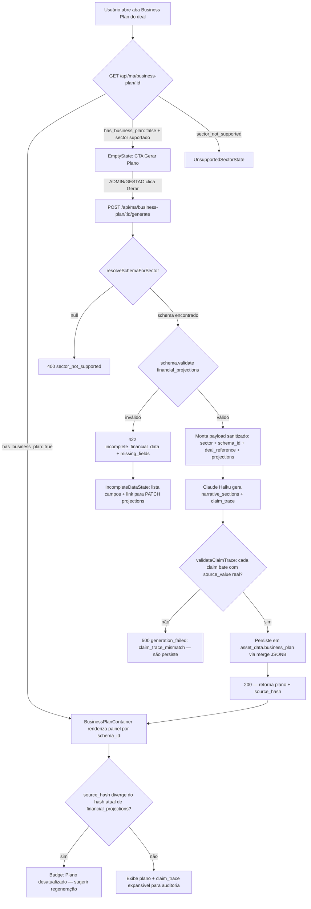

# Feature Spec — Business Plan Engine (Mesa M&A)

> Status: DRAFT — aguardando aprovação do BRIEF (seção 11)
> Autor: ORION (Arquiteto de Features V3 Partners)
> Data: 2026-06-08
> Sponsor de produto: João Lemos Netto (Head de Ativos)
> Dev responsável: Hamilton Santos

---

## 0. Business Case — por que construir agora

Em 2026-06-07 identificamos um incidente em produção: `components/ma/business-plan-panel.tsx`
foi escrito com schema, KPIs e **copy 100% hardcoded** para o deal Nelblue (MA-26-013,
Agropecuária — genética bovina/IGG Select), incluindo **nomes de pessoas físicas de
terceiros** (Dr. Fábio / Prof. Neimar Severo) embutidos no JSX. O componente era montado
genericamente na aba "Vendedor → Business Plan" para QUALQUER deal — ao abrir Araxá Metals
(Mineração), aparecia o conteúdo da Nelblue.

Causa raiz **não foi** vazamento de dado do banco (`ma_deals.asset_data` está limpo, a API
`/api/ma/projections/[id]` filtra corretamente por `dealId`) — foi **reuso indevido de
componente client-specific como genérico**. Corrigido emergencialmente com gate duplo por
`sector` (constante `APPLICABLE_SECTORS`), mas essa correção não escala: cobre 1 setor.

**Risco se não construirmos o motor genérico agora:**
- Cada novo setor (Energia, Mineração, Crédito) vai gerar o mesmo anti-padrão sob pressão
  de prazo — copy hardcoded, dados de terceiros embutidos, vazamento entre deals.
- João já abriu 23 deals em 8 setores distintos — a demanda por business plans automatizados
  vai crescer mais rápido que a capacidade de escrever componente por componente.

**O que o módulo entrega:**
1. Separação dura entre "modelo de números" (schema tipado por setor) e "geração de
   narrativa" (Claude narra em cima de números auditáveis — nunca inventa).
2. Painel de exibição genérico, dirigido por `sector`, sem JSX client-specific.
3. Rastreabilidade: toda claim do plano gerado aponta para o campo de origem no JSONB.

**Esclarecimento (2026-06-07):** João confirmou que ele próprio foi o único a ver os dados —
inseridos por ele mesmo como teste/validação, sem exposição a terceiros (cliente, comprador
ou parceiro externo). Não configura incidente real de exposição de dado pessoal; foi um
achado de QA interno corrigido preventivamente, sem necessidade de notificação a titulares
(rebaixado de "possível incidente LGPD" — ver `session-decisions.md` 2026-06-07). O ponto
estrutural permanece válido: este módulo nasce com o gate duplo por `sector` desde o design,
exatamente para que o anti-padrão (componente client-specific montado genericamente) nunca
se repita.

---

## 1. User Stories

**US-1** — Como membro da Mesa M&A (`MESA_OPERACIONAL`), quero abrir a aba "Business Plan"
de um deal de Real Estate e ver um plano de negócio gerado a partir dos números reais já
cadastrados em `financial_projections`, para apresentar ao comprador sem montar manualmente.

**US-2** — Como ADMIN ou GESTAO, quero dar o comando para "gerar/regenerar o business plan"
de um deal, sabendo que o sistema **bloqueia a geração** se os números estruturados não
estiverem completos — para nunca entregar um plano com dado inventado pela IA.

**US-3** — Como ADMIN ou GESTAO, quero que o painel mostre, para cada afirmação do plano
gerado, de onde veio o número (rastreabilidade claim → campo JSONB) — para auditar a
narrativa antes de enviar a um investidor.

**US-4** — Como dev (Hamilton), quero que adicionar um novo setor ao motor seja: registrar
um schema tipado + um template de visualização — sem tocar no motor de geração nem
duplicar lógica de gate/validação.

**US-5** — Como ADMIN, quero que o `BusinessPlanPanel` atual (hardcoded Nelblue) seja
descontinuado sem quebrar a navegação de nenhum deal em produção — inclusive o próprio
Nelblue, que deve migrar para o novo formato genérico ou exibir estado "plano não gerado".

---

## 2. Decisão de arquitetura — onde vivem os dados estruturados

**Decisão: manter `ma_deals.asset_data.financial_projections` (JSONB) como fonte única
de números — NÃO criar tabela `business_plan_schemas` nem tabela de planos gerados.**

Justificativa:
- A API `/api/ma/projections/[id]` já existe, já tem GET/PATCH funcionando, já tem
  role-gating (`VIEW_ROLES`/`EDIT_ROLES`) e já é o "gold standard" populado para
  V3-2026-05-REA-001. Criar tabela nova duplicaria esse caminho de dados.
- ADR V3 estabelecido: "financial_projections vive em `ma_deals.asset_data` JSONB
  (sem nova tabela)" — registrado em sessão 2026-05-21, reafirmado aqui.
- Os **schemas por setor** (a estrutura/tipo, não os dados) são versionados como
  **constantes TypeScript tipadas** em `lib/ma/business-plan-schemas/`, não em tabela —
  porque schema é código (precisa de type-safety, code review, CI), não dado de negócio
  editável em runtime. Trocar schema de setor é deploy, não edição de registro.
- O **plano gerado** (narrativa Claude) é persistido em `ma_deals.asset_data.business_plan`
  (mesmo JSONB, novo sub-campo) — segue o padrão já estabelecido para `forja_result`,
  `teaser_cego`, `tese_investimento` etc.

**Consequência prática:** nenhuma migration cria tabela nova. A única migration necessária
é **opcional e defensiva**: garantir que `ma_deals.asset_data` tenha os sub-campos
`financial_projections` e `business_plan` documentados via comentário de coluna (não
estrutural — JSONB é schemaless). Ver seção 3.

**Alternativa descartada:** tabela `business_plan_schemas` com linha por setor + JSONB de
definição de campos. Descartada porque (a) duplicaria o padrão JSONB já em produção,
(b) schemas mudam por deploy de código/regra de negócio, não por edição operacional —
colocar em tabela editável via UI criaria risco de um operador "destravar" a geração
trocando o schema em produção sem revisão técnica, e (c) adiciona uma tabela + RLS +
migração para resolver um problema que constantes TypeScript versionadas resolvem com
zero infraestrutura nova.

---

## 3. SQL de Migration

Não há alteração estrutural (JSONB é schemaless e os sub-campos já existem em produção
para o deal Méier). Entregamos uma migration **defensiva e documental**, idempotente,
que:
1. Adiciona comentário de coluna documentando o contrato `asset_data.financial_projections`
   e `asset_data.business_plan` (auto-documentação do schema JSONB para `\d+` / introspecção).
2. Cria um índice GIN parcial em `asset_data` filtrado por presença de `financial_projections`
   — acelera a query "quais deals têm projections estruturadas" usada pelo gate de geração
   e por dashboards futuros (Analytics Layer).

```sql
-- ============================================================================
-- Migration: business_plan_engine_jsonb_contract
-- Data: 2026-06-08
-- Autor: Dara (via handoff ORION)
-- Propósito: documentar contrato JSONB de asset_data.financial_projections e
--            asset_data.business_plan + índice de aceleração do gate de geração.
-- Não cria tabelas. Não altera colunas existentes. 100% idempotente e reversível.
-- ============================================================================

-- 1) Comentário documental no contrato JSONB (não estrutural — apenas catálogo)
COMMENT ON COLUMN ma_deals.asset_data IS
  'JSONB rico do deal. Sub-campos relevantes ao Business Plan Engine:
   asset_data.financial_projections — números estruturados por setor (fonte única,
     populada via PATCH /api/ma/projections/[id]). Schema versionado em
     lib/ma/business-plan-schemas/ por setor. Real Estate: receita, noi_mensal,
     vacancia_pct, despesas_breakdown, scenarios, last_updated, updated_from_qa.
   asset_data.business_plan — narrativa gerada pelo motor (POST
     /api/ma/business-plan/[id]/generate). Estrutura: { sector, schema_version,
     generated_at, generated_by, model, narrative_sections[], claim_trace[],
     source_hash }. NUNCA contém números calculados pela IA — apenas prosa sobre
     números de financial_projections, com claim_trace apontando o caminho JSONB
     de origem de cada afirmação numérica.';

-- 2) Índice GIN parcial — acelera filtro "deals com projections estruturadas"
--    (usado pelo gate de geração e por telas de listagem/dashboard)
CREATE INDEX CONCURRENTLY IF NOT EXISTS idx_ma_deals_has_financial_projections
  ON ma_deals USING gin ((asset_data -> 'financial_projections'))
  WHERE asset_data ? 'financial_projections';

-- 3) Índice btree funcional sobre sector — já deve existir cobertura via outras
--    queries, mas garantimos cobertura específica para o filtro do motor
--    (carregar deal por sector + presença de projections é o caminho quente)
CREATE INDEX CONCURRENTLY IF NOT EXISTS idx_ma_deals_sector_lower
  ON ma_deals (lower(sector));

-- ============================================================================
-- ROLLBACK
-- ============================================================================
-- DROP INDEX CONCURRENTLY IF EXISTS idx_ma_deals_sector_lower;
-- DROP INDEX CONCURRENTLY IF EXISTS idx_ma_deals_has_financial_projections;
-- COMMENT ON COLUMN ma_deals.asset_data IS NULL;
-- ============================================================================
```

**Nota sobre `sector` texto-livre:** os dados reais mostram inconsistência de grafia
("Agronegócio" / "Agronegocio" / "Agropecuária"). O índice `lower(sector)` e o
`SECTOR_ALIASES` map (seção 5) tratam isso na camada de aplicação — **não normalizamos
a coluna em produção nesta fase** (seria breaking change retroativo em 23 deals e exigiria
auditoria de todas as queries que filtram por `sector`). Registrado como débito técnico
no roadmap (seção 9), não nesta entrega.

---

## 4. Role-Gating

Reaproveita exatamente os papéis já definidos em `/api/ma/projections/[id]/route.ts` —
sem criar matriz nova, sem inconsistência entre "quem edita números" e "quem gera plano".

| Ação | ADMIN | GESTAO | MESA_OPERACIONAL | MESA | Outros |
|---|---|---|---|---|---|
| Visualizar Business Plan gerado | sim | sim | sim | sim* | não |
| Disparar geração/regeneração (`POST .../generate`) | sim | sim | não | não | não |
| Editar números estruturados (`PATCH /api/ma/projections/[id]`) | sim | sim | não | não | não |
| Visualizar números estruturados (`GET /api/ma/projections/[id]`) | sim | sim | sim | não | não |

`*` MESA tem acesso à Mesa M&A em geral (rota `/mesa-ma`); o painel de Business Plan herda
o gate de visualização de `VIEW_ROLES`— adicionamos `MESA` à constante de visualização do
novo endpoint para manter paridade com o acesso de tela já existente (ver `VIEW_ROLES`
estendida na seção 5). **Geração permanece restrita a ADMIN/GESTAO** — é uma operação que
consome tokens Claude e grava no JSONB do deal; mesmo padrão de `EDIT_ROLES` da rota de
projections.

```typescript
// lib/ma/business-plan-roles.ts
export const BUSINESS_PLAN_VIEW_ROLES = ["ADMIN", "GESTAO", "MESA_OPERACIONAL", "MESA"];
export const BUSINESS_PLAN_GENERATE_ROLES = ["ADMIN", "GESTAO"];
```

---

## 5. Schema TypeScript — Registro de Schemas por Setor

### 5.1 Estrutura do registro (extensível para Fases 2/3)

```typescript
// lib/ma/business-plan-schemas/registry.ts

export type SectorSchemaId =
  | "real-estate-v1"
  | "agronegocio-v1"      // Fase 2 — placeholder, não implementar agora
  | "energia-v1"          // Fase 2 — placeholder
  | "mineracao-v1"        // Fase 3 — placeholder
  | "credito-v1";         // Fase 3 — placeholder

export interface SectorSchemaDefinition<T = unknown> {
  id: SectorSchemaId;
  version: number;
  /** Setores (grafia normalizada lower-case) que este schema atende */
  sectorAliases: string[];
  /** Valida e normaliza o JSONB cru de financial_projections */
  validate: (raw: unknown) => { valid: boolean; data?: T; missingFields?: string[] };
  /** Lista de campos obrigatórios para o gate "números completos" liberar geração */
  requiredFields: string[];
  /** Template de visualização (componente React) associado */
  panelComponent: string; // path para lazy import
}

// Normalização de grafias inconsistentes observadas nos 23 deals reais
export const SECTOR_ALIASES: Record<string, SectorSchemaId> = {
  "real estate": "real-estate-v1",
  "imobiliario": "real-estate-v1",
  "agronegócio": "agronegocio-v1",
  "agronegocio": "agronegocio-v1",
  "agropecuária": "agronegocio-v1",
  "agropecuaria": "agronegocio-v1",
  "energia": "energia-v1",
  "energia solar": "energia-v1",
  "mineração": "mineracao-v1",
  "mineracao": "mineracao-v1",
  "metais": "mineracao-v1",
  "crédito": "credito-v1",
  "credito": "credito-v1",
  "recebíveis": "credito-v1",
};

export function resolveSchemaForSector(sector: string | null): SectorSchemaId | null {
  if (!sector) return null;
  return SECTOR_ALIASES[sector.trim().toLowerCase()] ?? null;
}

export const SCHEMA_REGISTRY: Record<SectorSchemaId, SectorSchemaDefinition | null> = {
  "real-estate-v1": realEstateSchemaV1,   // implementado nesta fase
  "agronegocio-v1": null,                 // Fase 2
  "energia-v1": null,                     // Fase 2
  "mineracao-v1": null,                   // Fase 3
  "credito-v1": null,                     // Fase 3
};
```

### 5.2 Schema Real Estate v1 — baseado 100% no formato real de V3-2026-05-REA-001

Estrutura extraída diretamente de `ma_deals.asset_data.financial_projections` do deal
Shopping do Méier (único deal com dado estruturado real e validado em produção):

```typescript
// lib/ma/business-plan-schemas/real-estate-v1.ts

export interface RealEstateDespesasBreakdown {
  condominio?: number;
  iptu?: number;
  manutencao?: number;
  seguros?: number;
  administracao?: number;
  [categoria: string]: number | undefined; // breakdown é extensível por deal
}

export interface RealEstateScenario {
  nome: string;                  // ex: "Conservador", "Base", "Otimista"
  receita_projetada?: number;
  noi_projetado?: number;
  premissas?: string[];          // texto curto, NUNCA vira prosa fixa — só insumo p/ Claude
}

export interface RealEstateFinancialProjections {
  receita: number;                       // receita bruta mensal/anual (conforme cadastro)
  noi_mensal: number;                    // Net Operating Income mensal
  vacancia_pct: number;                  // 0-100
  despesas_breakdown: RealEstateDespesasBreakdown;
  scenarios?: RealEstateScenario[];
  meta?: {
    last_updated: string;                // ISO timestamp — gravado pelo PATCH existente
    updated_by?: string;
    updated_from_qa?: boolean;
  };
}

export const REAL_ESTATE_REQUIRED_FIELDS = [
  "receita",
  "noi_mensal",
  "vacancia_pct",
  "despesas_breakdown",
] as const;

export const realEstateSchemaV1: SectorSchemaDefinition<RealEstateFinancialProjections> = {
  id: "real-estate-v1",
  version: 1,
  sectorAliases: ["real estate", "imobiliario"],
  requiredFields: [...REAL_ESTATE_REQUIRED_FIELDS],
  panelComponent: "components/ma/business-plan/panels/real-estate-panel",
  validate: (raw) => {
    if (!raw || typeof raw !== "object") {
      return { valid: false, missingFields: [...REAL_ESTATE_REQUIRED_FIELDS] };
    }
    const obj = raw as Record<string, unknown>;
    const missing = REAL_ESTATE_REQUIRED_FIELDS.filter((f) => obj[f] === undefined || obj[f] === null);
    if (missing.length > 0) return { valid: false, missingFields: missing };
    if (typeof obj.vacancia_pct === "number" && (obj.vacancia_pct < 0 || obj.vacancia_pct > 100)) {
      return { valid: false, missingFields: ["vacancia_pct (fora do intervalo 0-100)"] };
    }
    return { valid: true, data: obj as unknown as RealEstateFinancialProjections };
  },
};
```

### 5.3 Mapa de campos-chave para Fases 2/3 (estrutura pronta, schema não detalhado)

Reservado no `SCHEMA_REGISTRY` como `null` — quando a Fase entrar, basta implementar
o `SectorSchemaDefinition` e trocar `null` pela definição. Campos-chave já mapeados a
partir do que existe hoje no código (ex.: `types/deal-financial-agro.ts` do Nelblue,
a refazer corretamente como dado, não como prosa fixa):

| Setor | Schema id | Campos-chave previstos |
|---|---|---|
| Agronegócio | `agronegocio-v1` | `ciclo_produtivo`, `comparativo_igg`, `fase_exportacao.volume_cabecas_ano`, `custo_gacc`, `custo_halal`, `preco_arroba_projetado` |
| Energia | `energia-v1` | `fator_capacidade_pct`, `ppa_tarifa_kwh`, `capacidade_instalada_mw`, `vida_util_projeto_anos`, `curva_geracao_mensal` |
| Mineração | `mineracao-v1` | `reserva_provada_ton`, `teor_medio`, `preco_commodity_referencia`, `custo_extracao_ton`, `vida_util_mina_anos` |
| Crédito | `credito-v1` | `inadimplencia_pct`, `spread_medio_aa`, `duration_meses`, `pdd_constituida`, `carteira_ativa` |

⚠️ **Regra permanente herdada do incidente Nelblue:** nenhum desses schemas pode conter
**nomes de pessoas físicas, contatos ou qualquer dado pessoal de terceiros** como campo
estruturado ou exemplo embutido em código. Dados de PF, se necessários à narrativa,
vivem em `asset_data` sob LGPD Track B (PJ autorizado; PF requer novo sign-off Robson) —
nunca em schema TypeScript versionado e commitado.

---

## 6. API Design

### 6.1 `POST /api/ma/business-plan/[id]/generate`

Dispara a geração (ou regeneração) do plano de negócio para o deal `id`.

**Roles:** `BUSINESS_PLAN_GENERATE_ROLES` (ADMIN, GESTAO)

**Request:**
```http
POST /api/ma/business-plan/{deal_id}/generate
Content-Type: application/json

{
  "force_regenerate": false   // opcional — se true, ignora cache de business_plan existente
}
```

**Fluxo (gate números-antes-de-narrativa):**
1. Auth + role gate → 401 / 403
2. Carrega `ma_deals.{id, sector, asset_data}`
3. `resolveSchemaForSector(deal.sector)` → se `null` ou schema ainda não implementado
   no registry → **400** `{ error: "sector_not_supported", sector, supported_sectors: [...] }`
4. `schema.validate(asset_data.financial_projections)` → se `valid: false` →
   **422** `{ error: "incomplete_financial_data", missing_fields: [...], action_required: "Preencha os números via PATCH /api/ma/projections/{id} antes de gerar o plano" }`
   — **bloqueio duro: sem dado validado, sem geração. Nunca cai para "deixa a IA inventar".**
5. Se `business_plan` já existe e `force_regenerate !== true` → retorna o cache existente
   com `regenerated: false` (evita custo de token redundante)
6. Monta payload sanitizado (apenas `financial_projections` validado + metadados não
   sensíveis do deal: `sector`, `v3_code`/`legacy_code`, `status`) — **nunca** envia
   `asset_data` bruto, `forja_result`, `notes`, dados de contato (mesmo padrão `sanitizeDeal`)
7. Chama Claude (config seção 7) → recebe `narrative_sections[]` + `claim_trace[]`
8. Persiste em `asset_data.business_plan` via merge (mesmo padrão do PATCH de projections)
9. Retorna **200**

**Response (200 — sucesso):**
```json
{
  "success": true,
  "deal_id": "uuid",
  "sector": "Real Estate",
  "schema_id": "real-estate-v1",
  "regenerated": true,
  "business_plan": {
    "schema_version": 1,
    "generated_at": "2026-06-08T14:32:00Z",
    "generated_by": "joao.lemos@v3partners.com.br",
    "model": "claude-haiku-4-5-20251001",
    "narrative_sections": [
      {
        "id": "visao-geral",
        "title": "Visão Geral do Ativo",
        "body_md": "O Shopping do Méier opera com NOI mensal de R$ X..."
      },
      {
        "id": "premissas-financeiras",
        "title": "Premissas Financeiras",
        "body_md": "..."
      },
      {
        "id": "cenarios",
        "title": "Cenários Projetados",
        "body_md": "..."
      }
    ],
    "claim_trace": [
      {
        "claim": "NOI mensal de R$ X",
        "source_path": "asset_data.financial_projections.noi_mensal",
        "source_value": 1850000
      },
      {
        "claim": "Vacância projetada de Y%",
        "source_path": "asset_data.financial_projections.vacancia_pct",
        "source_value": 8.5
      }
    ],
    "source_hash": "sha256:..."
  }
}
```

**Error codes:**
| Código | Body | Quando |
|---|---|---|
| 401 | `{ "error": "Unauthorized" }` | sem sessão |
| 403 | `{ "error": "Forbidden" }` | role fora de GENERATE_ROLES |
| 404 | `{ "error": "Deal not found" }` | deal_id inválido |
| 400 | `{ "error": "sector_not_supported", sector, supported_sectors }` | setor sem schema implementado |
| 422 | `{ "error": "incomplete_financial_data", missing_fields, action_required }` | gate de números falhou |
| 500 | `{ "error": "generation_failed", detail }` | falha Claude / persistência |
| 504 | `{ "error": "generation_timeout" }` | proteção two-phase (ver seção 7) |

### 6.2 `GET /api/ma/business-plan/[id]`

Recupera o plano já gerado (sem disparar geração nova).

**Roles:** `BUSINESS_PLAN_VIEW_ROLES` (ADMIN, GESTAO, MESA_OPERACIONAL, MESA)

**Response (200):**
```json
{
  "success": true,
  "deal_id": "uuid",
  "sector": "Real Estate",
  "schema_id": "real-estate-v1",
  "has_business_plan": true,
  "business_plan": { "...": "mesma estrutura do generate" }
}
```

Se não houver plano gerado: `{ "success": true, "has_business_plan": false, "business_plan": null }`
— **200, não 404** — ausência de plano é estado válido (deal ainda não processado), o
painel de exibição trata isso como "Gerar plano" (CTA), não como erro.

### 6.3 Reuso — `GET|PATCH /api/ma/projections/[id]` (já existe, sem alteração)

O motor de geração consome `GET /api/ma/projections/[id]` internamente (server-to-server,
mesmo processo) para ler `financial_projections` validado. Nenhuma mudança de contrato
nessa rota — ela continua sendo a única porta de entrada/saída de números estruturados.

---

## 7. Motor de Geração — Especificação

### 7.1 Princípio: números são fato, narrativa é interpretação

O Claude **nunca** recebe a instrução de calcular, projetar ou estimar valores financeiros.
Ele recebe um **payload de números já validados** e a instrução de **narrar, contextualizar
e estruturar** esses números em seções de um plano de negócio. Cada frase que cita um
número deve ser rastreável a um campo do payload — essa rastreabilidade é **extraída do
próprio output estruturado do modelo** (`claim_trace[]`), não inferida depois.

### 7.2 Two-phase (ADR-001 / proteção contra timeout Vercel 60s)

Como o payload é pequeno (números estruturados, sem PDFs, ~1-2KB), aplicamos o mesmo
raciocínio do ADR-001 (FORJA Fase 2): **Haiku é suficiente, não Sonnet**. Não há leitura
de documentos longos — é estruturação de narrativa sobre dado tabular curto. Mantemos
arquitetura two-phase mesmo assim, por padrão de defesa V3 contra 504:

- **Fase 1 (síncrona, dentro do POST /generate):** Haiku gera `narrative_sections[]` +
  `claim_trace[]` em uma única chamada — payload pequeno, latência esperada 4-10s.
- **Não há Fase 2 assíncrona necessária** nesta primeira fatia (diferente da FORJA, que
  processa PDFs grandes). Documentamos a opção de extrair para job assíncrono **apenas
  se** a latência observada em produção ultrapassar 25s — gatilho de revisão, não
  implementação antecipada (YAGNI).

### 7.3 Configuração Claude

```typescript
// lib/ma/business-plan-engine/generate.ts

const BUSINESS_PLAN_MODEL = "claude-haiku-4-5-20251001"; // ADR-001: Haiku para payload <800 tokens sem PDFs
const BUSINESS_PLAN_MAX_TOKENS = 4096; // ADR-003: default global de squads — não é Executor de Deals (6000)

const SYSTEM_PROMPT = `Você é o motor de geração de Business Plans da Mesa M&A da V3 Partners.

REGRAS ABSOLUTAS — violar qualquer uma invalida o output:
1. Você recebe um payload de NÚMEROS JÁ VALIDADOS. Nunca calcule, estime, projete ou
   invente qualquer valor financeiro. Se um número não está no payload, NÃO o mencione.
2. Toda afirmação numérica no texto deve ter uma entrada correspondente em claim_trace[]
   apontando o caminho exato do campo de origem (ex: "financial_projections.noi_mensal").
3. Nunca inclua nomes de pessoas físicas, contatos, CPF, endereço ou qualquer dado pessoal
   de terceiros — mesmo que pareça relevante para a narrativa. Refira-se à "gestão do ativo",
   "operador" ou "estrutura de gestão", nunca a indivíduos nomeados.
4. Tom institucional, direto, em português do Brasil. Sem floreios. Sem emojis.
5. Estruture em seções: Visão Geral do Ativo · Premissas Financeiras · Cenários Projetados
   (se houver scenarios[] no payload) · Riscos e Considerações.
6. Se o payload não contiver dados suficientes para uma seção, omita a seção — nunca
   preencha com generalidades para parecer completo.

Responda em JSON estrito conforme o schema fornecido.`;
```

```typescript
// chamada (cache_control no system prompt — reduz custo em regenerações)
const response = await anthropic.messages.create({
  model: BUSINESS_PLAN_MODEL,
  max_tokens: BUSINESS_PLAN_MAX_TOKENS,
  system: [{ type: "text", text: SYSTEM_PROMPT, cache_control: { type: "ephemeral" } }],
  messages: [{ role: "user", content: JSON.stringify(sanitizedPayload) }],
});
```

### 7.4 Payload sanitizado (entrada do modelo)

```typescript
interface BusinessPlanGenerationPayload {
  sector: string;
  schema_id: SectorSchemaId;
  deal_reference: string;        // v3_code ou legacy_code — NUNCA nome do vendedor/comprador
  financial_projections: unknown; // já validado pelo schema.validate()
}
```

Explicitamente **excluído** do payload (mesmo espírito do `sanitizeDeal` / ADR-005):
`asset_data` completo, `notes`, `forja_result`, `descricao_ia`, `teaser_cego`,
`tese_investimento`, contatos do vendedor/comprador, qualquer campo de PF.

### 7.5 Output estruturado e rastreabilidade

O modelo retorna JSON com `narrative_sections[]` e `claim_trace[]` (estrutura na seção 6.1).
Validação pós-resposta (camada de aplicação, não confiança cega no modelo):

```typescript
function validateClaimTrace(plan: GeneratedPlan, sourceData: Record<string, unknown>): boolean {
  return plan.claim_trace.every((claim) => {
    const value = getByPath(sourceData, claim.source_path); // ex: "financial_projections.noi_mensal"
    return value !== undefined && value === claim.source_value;
  });
}
```

Se `validateClaimTrace` falhar para qualquer claim → **não persiste**, retorna 500
`generation_failed` com detalhe `claim_trace_mismatch` — proteção contra alucinação
numérica que escapou do prompt. Esse é o gate final antes de qualquer texto chegar
à tela ou a um documento comercial.

### 7.6 `source_hash`

`sha256` do JSON de `financial_projections` no momento da geração — grava no
`business_plan.source_hash`. Permite ao painel detectar "números mudaram desde a última
geração" e sugerir regeneração (CTA "Plano desatualizado — números foram editados em
{data}, regenerar?"), sem necessidade de tabela de versionamento.

---

## 8. Painel de Exibição Genérico — Especificação + Plano de Migração

### 8.1 Arquitetura do painel genérico

```
components/ma/business-plan/
├── business-plan-container.tsx     ← monta por sector, busca via GET, decide estado
├── empty-state.tsx                  ← "Plano não gerado" + CTA (roles GENERATE)
├── incomplete-data-state.tsx        ← "Números incompletos" + lista missing_fields + link p/ projections
├── unsupported-sector-state.tsx     ← "Setor ainda não suportado pelo motor" (Fase 2/3)
└── panels/
    └── real-estate-panel.tsx        ← template de visualização Real Estate (única fase atual)
        (agronegocio-panel.tsx, energia-panel.tsx etc. entram nas Fases 2/3)
```

`business-plan-container.tsx` é o **único** ponto que decide o que renderizar — e decide
**exclusivamente por dado vindo da API** (`sector`, `schema_id`, `has_business_plan`,
`missing_fields`), nunca por nome de aba ou suposição de contexto. Isso é a generalização
do gate `APPLICABLE_SECTORS` que já existe como correção emergencial — aqui ele se torna
a arquitetura padrão, não uma muleta.

```tsx
// business-plan-container.tsx (esqueleto)
"use client";
export function BusinessPlanContainer({ dealId, sector, dealCode }: Props) {
  const { data, status } = useBusinessPlan(dealId); // SWR/fetch a GET /api/ma/business-plan/[id]

  if (status === "loading") return <PanelSkeleton />;
  if (data?.error === "sector_not_supported") return <UnsupportedSectorState sector={sector} />;
  if (!data?.has_business_plan) {
    if (data?.missing_fields?.length) return <IncompleteDataState fields={data.missing_fields} dealId={dealId} />;
    return <EmptyState dealId={dealId} canGenerate={canGenerate(userRole)} />;
  }

  const PanelComponent = resolvePanelComponent(data.schema_id); // lazy import via registry
  if (!PanelComponent) return <UnsupportedSectorState sector={sector} />;

  return <PanelComponent plan={data.business_plan} dealCode={dealCode} />;
}
```

### 8.2 Template Real Estate v1

Renderiza, sem nenhuma string hardcoded de negócio:
- Header com `dealCode` + badge "Gerado em {generated_at} · {model}"
- Cards de KPI dirigidos por `claim_trace` (NOI, vacância, receita) — valor + label vêm
  do `source_value`/`source_path`, formatação (R$, %) por tipo inferido do path, não por
  string fixa
- Seções narrativas (`narrative_sections[]`) renderizadas como markdown
- Bloco de cenários (`scenarios[]`) se presente no payload original
- Rodapé "Auditoria" expansível: lista `claim_trace[]` completo (claim → caminho JSONB →
  valor), para revisão antes de envio externo
- Botão "Regenerar" (roles GENERATE) com aviso se `source_hash` diverge do hash atual de
  `financial_projections`

Paleta e tipografia: 100% V4.2 (`--nb` fundo, `--nc` cards, `--go`/`--gl` labels,
`--cr` títulos, `--mu` corpo, DM Sans). Zero cor ou fonte fora da paleta — gate de
identidade visual aplicado antes de qualquer commit deste componente.

### 8.3 Plano de migração segura — descontinuar `BusinessPlanPanel` atual

**Objetivo: zero downtime, zero regressão visível, sem big-bang.**

| Passo | Ação | Risco coberto |
|---|---|---|
| 1 | Criar `BusinessPlanContainer` e rotas novas em paralelo — **sem remover** `business-plan-panel.tsx` | Nenhuma quebra: componente antigo continua servindo enquanto o novo é validado |
| 2 | Em `mesa-ma-client.tsx`, trocar o ponto de montagem da aba "Vendedor → Business Plan" de `<BusinessPlanPanel sector={...} />` para `<BusinessPlanContainer dealId={...} sector={...} dealCode={...} />` | Troca de 1 linha — fácil rollback (reverter o import/JSX) |
| 3 | Para o deal Nelblue especificamente: **gerar o plano pelo motor novo** (uma vez o schema Agronegócio entrar na Fase 2) ou, até lá, exibir `EmptyState`/`UnsupportedSectorState` — **nunca** reativar o componente hardcoded antigo para esse deal | Garante que o conteúdo Nelblue (incluindo nomes de PF) só existe enquanto a aba não é acessada por outro contexto — elimina o vetor do incidente original |
| 4 | Deprecar `business-plan-panel.tsx`: adicionar comentário `@deprecated — substituído por BusinessPlanContainer (ver docs/specs/2026-06-business-plan-engine.md). Não reutilizar.` no topo do arquivo | Previne reuso acidental por outro dev/agente no futuro |
| 5 | Após 1 sprint de validação em produção sem regressão → remover `business-plan-panel.tsx` e a constante `APPLICABLE_SECTORS` (a generalização do container a torna redundante) | Limpeza final — só após confiança operacional |

Nenhum passo quebra produção: passos 1-2 são aditivos, passo 3 é decisão de conteúdo
(não de código), passos 4-5 são limpeza pós-validação.

---

## 9. Roadmap — Fases 2/3 (fora do escopo desta entrega)

| Fase | Setor | Pré-requisito | Estimativa adicional |
|---|---|---|---|
| Fase 2 | Agronegócio | Popular `financial_projections` real do Nelblue (hoje vazio — só existe `AgroFinancialProjections` em type não usado) seguindo o padrão correto (dado, não prosa fixa); revisão LGPD se schema referenciar pessoas (não deve) | ~16h (schema + panel + dados) |
| Fase 2 | Energia | Nenhum deal de Energia (4 no pipeline) tem `financial_projections` populado — levantamento de dados real necessário antes do schema | ~16h |
| Fase 3 | Mineração | 1 deal (Araxá Metals) — avaliar se justifica schema dedicado vs. template genérico de commodities | ~12h |
| Fase 3 | Crédito/Recebíveis | 1 deal — avaliar se Business Plan Engine é o veículo certo ou se Mesa de Crédito já cobre via `credit_desk_proposals` | ~8h (ou descartar) |
| Débito técnico | Normalização de `sector` | Migração de dado retroativo (23 deals, grafias inconsistentes) — fora do escopo deste módulo, mas bloqueia expansão limpa do `SECTOR_ALIASES` | a estimar separadamente |

---

## 10. Diagrama de Fluxo



---

## 11. PRE-EXECUTION BRIEF — Primeira Fatia (Real Estate)

```
━━━━━━━━━━━━━━━━━━━━━━━━━━━━━━━━━━━━━
  BRIEF — Business Plan Engine · Fase 1 (Real Estate)
━━━━━━━━━━━━━━━━━━━━━━━━━━━━━━━━━━━━━

SCOPE
  Construir motor genérico de geração de business plans dirigido por schema/setor,
  com gate duro "números validados antes de narrativa", e substituir o componente
  hardcoded BusinessPlanPanel por um container genérico — entregando primeiro o
  template Real Estate (único setor com financial_projections real e validado em
  produção: V3-2026-05-REA-001).

IMPACT
  Arquivos novos:
    - lib/ma/business-plan-roles.ts
    - lib/ma/business-plan-schemas/registry.ts
    - lib/ma/business-plan-schemas/real-estate-v1.ts
    - lib/ma/business-plan-engine/generate.ts (system prompt + chamada Claude + validateClaimTrace)
    - app/api/ma/business-plan/[id]/generate/route.ts
    - app/api/ma/business-plan/[id]/route.ts (GET)
    - components/ma/business-plan/business-plan-container.tsx
    - components/ma/business-plan/empty-state.tsx
    - components/ma/business-plan/incomplete-data-state.tsx
    - components/ma/business-plan/unsupported-sector-state.tsx
    - components/ma/business-plan/panels/real-estate-panel.tsx
    - supabase/migrations/20260608_business_plan_engine_jsonb_contract.sql
  Arquivos modificados:
    - components/mesa-ma/mesa-ma-client.tsx (trocar montagem do painel da aba)
    - components/ma/business-plan-panel.tsx (marcar @deprecated, manter até passo 5 da migração)
  Tabelas afetadas:
    - ma_deals — nenhuma alteração estrutural; apenas COMMENT + 2 índices (GIN parcial + btree funcional)
  Rotas afetadas:
    - Novas: POST /api/ma/business-plan/[id]/generate · GET /api/ma/business-plan/[id]
    - Reaproveitada sem alteração: GET|PATCH /api/ma/projections/[id]
  APIs externas:
    - Anthropic Claude (Haiku 4.5) — 1 chamada síncrona por geração

DEPENDENCIES
  Deve existir antes:
    - financial_projections populado e validado para o deal-alvo (gate bloqueia sem isso —
      hoje só V3-2026-05-REA-001 atende)
    - Nenhuma dependência de n8n, FORJA ou outro motor — módulo isolado
  Migrations pendentes:
    - 20260608_business_plan_engine_jsonb_contract.sql (defensiva — comentário + índices,
      CONCURRENTLY, sem lock de tabela, reversível)

RISKS
  Breaking changes:
    Não — passos 1-2 da migração (seção 8.3) são aditivos. business-plan-panel.tsx
    permanece funcional até passo 5 (remoção, só após 1 sprint de validação).
  LGPD/Compliance:
    Não há near-miss real a registrar — esclarecido por João em 2026-06-07 que o achado
    foi capturado em validação interna com dados de teste inseridos por ele mesmo, sem
    exposição a terceiros (ver `session-decisions.md`). ⚠️ ROBSON segue relevante apenas
    como validação preventiva: confirmar que o novo system prompt (regra 3, "nunca incluir
    nomes de PF") é controle suficiente antes de habilitar geração para setores com dado
    de PF potencialmente presente (Agronegócio, Fase 2).
  Performance:
    Baixo impacto — 1 chamada Claude por geração (cacheável via source_hash), payload
    <2KB, índices criados CONCURRENTLY (sem lock). Geração não é "hot path" — disparada
    sob demanda por ADMIN/GESTAO, não em toda renderização de tela.
  Vercel timeout (60s):
    Baixo — payload pequeno sem PDFs, modelo Haiku, latência esperada 4-10s. Two-phase
    mantido como defesa V3 padrão; extração para job assíncrono fica como gatilho de
    revisão se p95 > 25s em produção (não implementar antecipadamente).
  Outro:
    Risco de regressão visual no Nelblue — mitigado pelo passo 3 da migração (nunca
    reativar o componente antigo; exibir EmptyState até a Fase 2 cobrir Agronegócio).

APPROACH
  Abordagem escolhida:
    Manter financial_projections em ma_deals.asset_data (JSONB existente, API já
    funcional), registrar schemas por setor como constantes TypeScript versionadas
    (não tabela), persistir o plano gerado em asset_data.business_plan (mesmo padrão
    de forja_result/teaser_cego), e migrar o painel via container genérico dirigido
    100% por dado de API (sector/schema_id/has_business_plan), nunca por nome de aba.
  Alternativa descartada:
    Tabela business_plan_schemas editável via UI — descartada porque schema é decisão
    de código/arquitetura (precisa de type-safety e review), não dado operacional;
    colocar em tabela editável criaria risco de alguém destravar geração trocando
    schema em produção sem revisão técnica, além de duplicar o padrão JSONB já
    estabelecido e adicionar superfície de RLS/migração sem necessidade real.

ESTIMATE
  Complexidade:   M
  Esforço:        24 horas
    - Schema registry + Real Estate schema v1 + validação:           4h
    - Motor de geração (prompt, chamada Claude, claim_trace, hash):  6h
    - Rotas API (generate + GET) + role-gating + error handling:     4h
    - Painel container genérico + 4 estados + template Real Estate:  8h
    - Migração mesa-ma-client.tsx + deprecação + testes E2E:         2h
  Confiança:      Alta
    (API de projections já existe e testada; único setor com dado real já mapeado;
    padrão JSONB de persistência já em produção via forja_result/teaser_cego)

━━━━━━━━━━━━━━━━━━━━━━━━━━━━━━━━━━━━━
  Aguardando aprovação para executar.
  → Digite "go" para iniciar
  → Digite "ajusta: [instrução]" para modificar
  → Digite "cancela" para abortar
━━━━━━━━━━━━━━━━━━━━━━━━━━━━━━━━━━━━━
```

---

## 12. HANDOFF ORION → DARA

```
HANDOFF ORION → DARA
Feature:          Business Plan Engine — Fase 1 (Real Estate)
Tabelas novas:    nenhuma
Tabelas alteradas:ma_deals — sem alteração de coluna; apenas:
                    (a) COMMENT ON COLUMN asset_data documentando contrato
                        financial_projections / business_plan
                    (b) índice GIN parcial idx_ma_deals_has_financial_projections
                        em (asset_data -> 'financial_projections') WHERE asset_data
                        ? 'financial_projections'
                    (c) índice btree funcional idx_ma_deals_sector_lower em
                        (lower(sector))
RLS necessária:   nenhuma nova policy — leitura/escrita em ma_deals já coberta pelas
                  policies existentes via get_user_role(); novas rotas API replicam
                  o mesmo padrão de checagem de role em camada de aplicação que
                  /api/ma/projections/[id] já usa (svc() + profiles.role)
Funções SQL:      nenhuma nova — não há trigger nem função associada a este módulo
Índices críticos: idx_ma_deals_has_financial_projections (gate de geração e
                  dashboards futuros que filtram "deals com dado estruturado")
                  idx_ma_deals_sector_lower (resolução de schema por setor —
                  trata inconsistência de grafia sem normalizar a coluna)
Rollback plan:    DROP INDEX CONCURRENTLY idx_ma_deals_sector_lower;
                  DROP INDEX CONCURRENTLY idx_ma_deals_has_financial_projections;
                  COMMENT ON COLUMN ma_deals.asset_data IS NULL;
                  (100% reversível, sem perda de dado — nenhuma estrutura é criada
                  além de índices e comentário documental)
Context V3:       Migration deve usar CREATE INDEX CONCURRENTLY (sem lock de tabela
                  em produção); ma_deals tem 344 kB / 23 linhas — operação rápida
                  mesmo sem CONCURRENTLY, mas seguimos o padrão V3 de cautela em
                  tabela de pipeline ativo. Rodar snapshot antes (regra CLAUDE.md
                  "Database / Supabase — antes de qualquer migração: snapshot
                  obrigatório"). Nenhuma policy nova porque o módulo não introduz
                  nova superfície de dado — apenas lê/escreve em campo JSONB já
                  coberto pelas RLS policies de ma_deals.
```

---

## 13. Resumo executivo (para registro em session-decisions / fluxograma)

- Business Plan Engine Fase 1 (Real Estate): motor genérico dirigido por `sector`,
  schemas tipados versionados em código (não tabela), gate duro de validação numérica
  antes de qualquer narrativa Claude, rastreabilidade claim→campo JSONB obrigatória.
- Substitui `business-plan-panel.tsx` (hardcoded Nelblue) por `BusinessPlanContainer`
  genérico — migração em 5 passos sem downtime, sem big-bang, sem reativar o
  componente antigo para o deal Nelblue.
- Zero tabela nova — `ma_deals.asset_data.financial_projections` / `.business_plan`
  permanecem fonte única (JSONB), conforme ADR já estabelecido em 2026-05-21.
- Migration única: documental + 2 índices `CONCURRENTLY`, 100% reversível.
