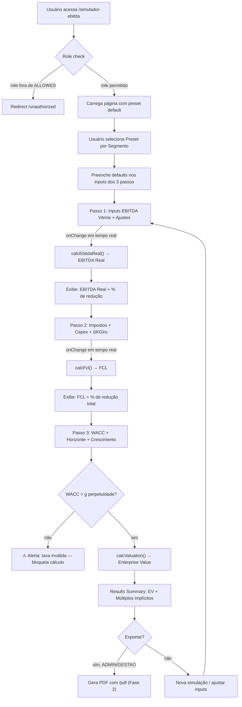

# Feature Spec — Simulador EBITDA-to-Valuation (Mesa M&A)

**Data:** 2026-06-19
**Gerado por:** ORION (v3-feature-architect)
**Complexidade:** M
**Esforço estimado:** 20 horas
**Dev responsável:** Hamilton Santos
**Sponsor:** João Lemos Netto

---

## 1. Business Case

### Por que construir

A Mesa M&A precisa de uma ferramenta que aplique o raciocínio de purificação de EBITDA
durante negociações com compradores profissionais. Hoje esse cálculo é feito manualmente
em planilhas dispersas, sem padronização nem rastreabilidade.

O simulador codifica a metodologia V3 de 3 etapas:
1. **EBITDA de Vitrine → EBITDA Real** (expurgo de despesas do sócio + provisão de risco
   por concentração de receita)
2. **EBITDA Real → FCL** (impostos, Capex, variação de capital de giro)
3. **FCL → Valuation** (DCF com taxa de desconto ajustada por risco operacional)

Sem essa ferramenta, cada deal exige reconstrução manual do raciocínio — risco de
erro, inconsistência entre deals e perda de argumentação em reuniões com buy-side.

### Impacto esperado

- Métrica principal: padronizar a análise de valuation em < 5 minutos por deal
- Usuários afetados: Mesa M&A (3-5 operadores) + João (originação)
- Receita: habilita argumentação defensável em negociações de M&A cross-border

### Alinhamento com roadmap V3

Vertical 4 (M&A e Negócios Cross-Border) — ferramenta de análise interna da Mesa.
Complementa o Business Plan Engine (narrativa) com o motor numérico (valuation).

---

## 2. Quem Usa

| Role | O que faz | Por que tem acesso |
|---|---|---|
| ADMIN | Manipula todos os inputs, exporta resultados | Sócio-fundador, lidera negociações |
| GESTAO | Manipula inputs, ajusta premissas por setor | Supervisão de deals |
| MESA | Visualiza e roda simulações para deals atribuídos | Operação diária da Mesa M&A |
| MESA_OPERACIONAL | Visualiza resultados | Suporte operacional |

**Roles sem acesso:** PARTNER, PARTNER_PRO, ORIGINADOR, FINANCEIRO — ferramenta interna
da Mesa, não exposta a partners.

**Nota de role-gating:** Esta feature é restrita a `ADMIN, GESTAO, MESA, MESA_OPERACIONAL`.
Qualquer outro role que tentar acessar recebe HTTP 403 (API) ou redirect `/unauthorized` (página).

---

## 3. PRE-EXECUTION BRIEF

> Preencher antes de qualquer código. Aguardar aprovação de João Lemos.

```
━━━━━━━━━━━━━━━━━━━━━━━━━━━━━━━━━━━━━
  BRIEF — Simulador EBITDA-to-Valuation
━━━━━━━━━━━━━━━━━━━━━━━━━━━━━━━━━━━━━

SCOPE
  Construir simulador interativo de 3 etapas (EBITDA Real → FCL → Valuation)
  como página standalone no portal V3 Partners, com inputs editáveis,
  presets por segmento e visualização de resultados em tempo real.
  Fase 1: frontend puro (cálculos client-side, sem persistência).
  Fase 2 (futura): persistência em ma_deals.asset_data.ebitda_simulation.

IMPACT
  Arquivos novos:
    - app/(platform)/simulador-ebitda/page.tsx
    - components/simulador/ebitda-simulator.tsx
    - components/simulador/step-ebitda-real.tsx
    - components/simulador/step-fcl.tsx
    - components/simulador/step-valuation.tsx
    - components/simulador/sector-presets.tsx
    - components/simulador/results-summary.tsx
    - lib/simulador/ebitda-calculator.ts (motor de cálculo puro)
    - lib/simulador/sector-presets.ts (constantes por segmento)
  Arquivos modificados:
    - components/layout/sidebar.tsx (adicionar link "Simulador EBITDA" na seção Mesa)
  Tabelas afetadas:     nenhuma (Fase 1 — sem persistência)
  Rotas API afetadas:   nenhuma (Fase 1 — cálculo 100% client-side)
  APIs externas:        nenhuma

DEPENDENCIES
  Deve existir antes:   nenhuma — módulo 100% independente
  Migrations pendentes: nenhuma (Fase 1)

RISKS
  Breaking changes:     Não — feature aditiva, nenhum arquivo existente alterado
                        além do sidebar (1 link novo)
  LGPD/Compliance:      Não — nenhum dado pessoal envolvido (apenas números financeiros
                        hipotéticos, não vinculados a PF/PJ identificável na Fase 1)
  Performance:          Zero impacto — cálculos client-side em JavaScript puro,
                        sem chamada API, sem banco, sem Claude
  Claude timeout (60s): N/A — nenhuma chamada Claude

APPROACH
  Abordagem escolhida:
    Simulador 100% client-side com React state. Sem persistência na Fase 1 —
    o foco é capturar a metodologia V3 de 3 etapas em UI interativa. Os presets
    por segmento são constantes TypeScript versionadas (mesmo padrão do
    SECTOR_ALIASES do Business Plan Engine). Cálculos em lib/simulador/
    separados do componente (testáveis isoladamente).
  Alternativa descartada:
    API server-side com persistência imediata — descartada porque a prioridade
    é capturar o raciocínio, não construir infra de armazenamento. Persistência
    entra na Fase 2 quando o fluxo de uso real validar quais campos merecem
    ser salvos por deal.

ESTIMATE
  Complexidade:   M
  Esforço:        20 horas
    - Motor de cálculo (3 etapas + terminal value):        4h
    - Presets por segmento (4 segmentos iniciais):          2h
    - Componente Step 1 — EBITDA Real (inputs + ajustes):   3h
    - Componente Step 2 — FCL (impostos, Capex, giro):     3h
    - Componente Step 3 — Valuation DCF (WACC, horizonte):  4h
    - Results Summary (cards KPI + comparativo):            2h
    - Sidebar link + role-gating + page wrapper:            1h
    - Testes unitários do motor de cálculo:                 1h
  Confiança:      Alta
    (feature aditiva sem dependências, cálculos determinísticos,
    sem integração externa, padrão de UI já estabelecido no portal)

━━━━━━━━━━━━━━━━━━━━━━━━━━━━━━━━━━━━━
  Aguardando aprovação para executar.
  → Digite "go" para iniciar
  → Digite "ajusta: [instrução]" para modificar
  → Digite "cancela" para abortar
━━━━━━━━━━━━━━━━━━━━━━━━━━━━━━━━━━━━━
```

---

## 4. Data Model

### Fase 1 — Sem persistência (cálculo client-side)

Nenhuma migration SQL necessária. Todos os dados vivem em React state
e são descartados ao fechar a página.

### Fase 2 — Persistência futura (não implementar agora)

Quando o uso real validar a necessidade de salvar simulações por deal:

```sql
-- Migration: ebitda_simulation_persistence (FASE 2 — NÃO APLICAR AGORA)
-- Persistir resultados de simulação em ma_deals.asset_data.ebitda_simulation

-- Opção A: sub-campo em asset_data JSONB (padrão V3 — preferido)
-- Estrutura: asset_data.ebitda_simulation = {
--   inputs: { ebitda_vitrine, despesas_socio, provisao_concentracao, ... },
--   resultados: { ebitda_real, fcl, valuation, multiplo_implicito },
--   preset_usado: "industria-v1",
--   simulado_em: "2026-06-19T14:00:00Z",
--   simulado_por: "joao.lemos@v3partners.com.br"
-- }
-- Sem migration estrutural — JSONB é schemaless. Apenas documentar:

-- COMMENT ON COLUMN ma_deals.asset_data IS
--   '... asset_data.ebitda_simulation — resultado do simulador EBITDA-to-Valuation
--    (3 etapas: EBITDA Real, FCL, DCF). Persistido via PATCH por deal_id. ...';

-- Índice para filtrar "deals com simulação":
-- CREATE INDEX CONCURRENTLY IF NOT EXISTS idx_ma_deals_has_ebitda_sim
--   ON ma_deals USING gin ((asset_data -> 'ebitda_simulation'))
--   WHERE asset_data ? 'ebitda_simulation';

-- ROLLBACK:
-- DROP INDEX CONCURRENTLY IF EXISTS idx_ma_deals_has_ebitda_sim;
```

### Tipos TypeScript (motor de cálculo)

```typescript
// lib/simulador/ebitda-calculator.ts

/** Passo 1: EBITDA Real */
export interface EbitdaRealInputs {
  ebitda_vitrine: number;            // EBITDA reportado pela empresa (R$)
  despesas_pessoais_socio: number;   // gastos pessoais do sócio embutidos (R$)
  provisao_concentracao: number;     // risco de concentração de receita (R$)
  outros_ajustes?: number;           // ajustes adicionais não recorrentes (R$)
}

/** Passo 2: FCL */
export interface FclInputs {
  ebitda_real: number;               // output do Passo 1
  aliquota_impostos_pct: number;     // 0-100 (IR + CSLL efetivo)
  capex_anual: number;               // investimento em ativos fixos (R$)
  variacao_capital_giro: number;     // ΔKGiro (positivo = consumo de caixa)
}

/** Passo 3: Valuation DCF */
export interface ValuationInputs {
  fcl_ano_base: number;              // output do Passo 2
  wacc_pct: number;                  // taxa de desconto ajustada (0-100)
  horizonte_anos: number;            // período de projeção explícita (5-10)
  taxa_crescimento_fcl_pct: number;  // crescimento anual do FCL no horizonte (0-100)
  crescimento_perpetuidade_pct: number; // g na perpetuidade (Gordon Growth)
}

/** Resultado consolidado */
export interface SimulationResult {
  ebitda_real: number;
  fcl: number;
  vp_fluxos_explicitos: number;      // PV dos FCLs no horizonte
  terminal_value: number;            // FCL_n * (1+g) / (WACC-g)
  vp_terminal_value: number;         // TV descontado
  enterprise_value: number;          // VP fluxos + VP terminal
  multiplo_ebitda_implicito: number; // EV / EBITDA Real
  multiplo_fcl_implicito: number;    // EV / FCL
}
```

---

## 5. API Design

### Fase 1 — Sem API (cálculo client-side)

Nenhuma rota API na Fase 1. O motor de cálculo roda inteiramente no browser:

```typescript
// lib/simulador/ebitda-calculator.ts — funções puras, sem side effects

export function calcEbitdaReal(inputs: EbitdaRealInputs): number {
  return inputs.ebitda_vitrine
    - inputs.despesas_pessoais_socio
    - inputs.provisao_concentracao
    - (inputs.outros_ajustes ?? 0);
}

export function calcFcl(inputs: FclInputs): number {
  const impostos = inputs.ebitda_real * (inputs.aliquota_impostos_pct / 100);
  return inputs.ebitda_real - impostos - inputs.capex_anual - inputs.variacao_capital_giro;
}

export function calcValuation(inputs: ValuationInputs): SimulationResult {
  const wacc = inputs.wacc_pct / 100;
  const g_horizonte = inputs.taxa_crescimento_fcl_pct / 100;
  const g_perp = inputs.crescimento_perpetuidade_pct / 100;

  // Fluxos explícitos descontados
  let vp_fluxos = 0;
  let fcl_t = inputs.fcl_ano_base;
  const fcls: number[] = [];

  for (let t = 1; t <= inputs.horizonte_anos; t++) {
    fcl_t = t === 1 ? inputs.fcl_ano_base : fcl_t * (1 + g_horizonte);
    vp_fluxos += fcl_t / Math.pow(1 + wacc, t);
    fcls.push(fcl_t);
  }

  // Terminal Value (Gordon Growth Model)
  const fcl_terminal = fcls[fcls.length - 1] * (1 + g_perp);
  const terminal_value = fcl_terminal / (wacc - g_perp);
  const vp_terminal = terminal_value / Math.pow(1 + wacc, inputs.horizonte_anos);

  const enterprise_value = vp_fluxos + vp_terminal;

  return {
    ebitda_real: inputs.fcl_ano_base, // passado externamente
    fcl: inputs.fcl_ano_base,
    vp_fluxos_explicitos: vp_fluxos,
    terminal_value,
    vp_terminal_value: vp_terminal,
    enterprise_value,
    multiplo_ebitda_implicito: 0, // calculado no componente (precisa do EBITDA Real)
    multiplo_fcl_implicito: enterprise_value / inputs.fcl_ano_base,
  };
}
```

### Fase 2 — API de persistência (futura)

```
PATCH /api/ma/deals/[deal_id]/ebitda-simulation
Auth: Bearer token (Supabase)
Role: ADMIN, GESTAO
Body: { inputs, resultados, preset_usado }
→ Merge em ma_deals.asset_data.ebitda_simulation
```

---

## 6. UI/UX

### Componente principal

```
app/(platform)/simulador-ebitda/page.tsx
  └── components/simulador/ebitda-simulator.tsx
        ├── sector-presets.tsx          ← dropdown com presets por segmento
        ├── step-ebitda-real.tsx        ← Passo 1: inputs de ajuste
        ├── step-fcl.tsx               ← Passo 2: impostos, Capex, giro
        ├── step-valuation.tsx         ← Passo 3: WACC, horizonte, perpetuidade
        └── results-summary.tsx        ← KPIs + waterfall visual
```

### Presets por segmento (constantes TypeScript)

```typescript
// lib/simulador/sector-presets.ts

export interface SectorPreset {
  id: string;
  label: string;
  defaults: {
    aliquota_impostos_pct: number;
    capex_sobre_receita_pct: number;
    wacc_range: [number, number];      // [min, max] para slider
    wacc_default: number;
    crescimento_fcl_pct: number;
    crescimento_perpetuidade_pct: number;
    horizonte_anos: number;
    // sugestões de ajuste típicas do setor
    concentracao_tipica_pct: number;    // % de receita do maior cliente
    despesas_socio_tipico_pct: number;  // % do EBITDA em gastos do sócio
  };
}

export const SECTOR_PRESETS: SectorPreset[] = [
  {
    id: "industria",
    label: "Indústria",
    defaults: {
      aliquota_impostos_pct: 34,
      capex_sobre_receita_pct: 8,
      wacc_range: [12, 18],
      wacc_default: 15,
      crescimento_fcl_pct: 5,
      crescimento_perpetuidade_pct: 3,
      horizonte_anos: 7,
      concentracao_tipica_pct: 30,
      despesas_socio_tipico_pct: 10,
    },
  },
  {
    id: "varejo",
    label: "Varejo",
    defaults: {
      aliquota_impostos_pct: 34,
      capex_sobre_receita_pct: 4,
      wacc_range: [14, 22],
      wacc_default: 18,
      crescimento_fcl_pct: 3,
      crescimento_perpetuidade_pct: 2.5,
      horizonte_anos: 5,
      concentracao_tipica_pct: 15,
      despesas_socio_tipico_pct: 15,
    },
  },
  {
    id: "tecnologia",
    label: "Tecnologia / SaaS",
    defaults: {
      aliquota_impostos_pct: 34,
      capex_sobre_receita_pct: 3,
      wacc_range: [15, 25],
      wacc_default: 20,
      crescimento_fcl_pct: 15,
      crescimento_perpetuidade_pct: 4,
      horizonte_anos: 10,
      concentracao_tipica_pct: 20,
      despesas_socio_tipico_pct: 8,
    },
  },
  {
    id: "servicos",
    label: "Serviços Profissionais",
    defaults: {
      aliquota_impostos_pct: 34,
      capex_sobre_receita_pct: 2,
      wacc_range: [16, 24],
      wacc_default: 20,
      crescimento_fcl_pct: 4,
      crescimento_perpetuidade_pct: 2,
      horizonte_anos: 5,
      concentracao_tipica_pct: 40,
      despesas_socio_tipico_pct: 20,
    },
  },
  {
    id: "agronegocio",
    label: "Agronegócio",
    defaults: {
      aliquota_impostos_pct: 28,
      capex_sobre_receita_pct: 12,
      wacc_range: [13, 20],
      wacc_default: 16,
      crescimento_fcl_pct: 6,
      crescimento_perpetuidade_pct: 3,
      horizonte_anos: 7,
      concentracao_tipica_pct: 25,
      despesas_socio_tipico_pct: 12,
    },
  },
];
```

### Layout do Passo 1 — EBITDA Real

```
┌──────────────────────────────────────────────────────────┐
│  ◉ Preset: [ Indústria ▾ ]                               │
├──────────────────────────────────────────────────────────┤
│                                                          │
│  EBITDA de Vitrine (R$)     [ 20.000.000 ]               │
│                                                          │
│  ─── Ajustes de Purificação ───                          │
│                                                          │
│  Despesas Pessoais do Sócio (R$)  [ 3.000.000 ]          │
│  ℹ️ Veículos, viagens, cartões corporativos pessoais     │
│                                                          │
│  Provisão de Concentração (R$)    [ 3.000.000 ]          │
│  ℹ️ Risco de perda do maior cliente (>30% da receita)    │
│                                                          │
│  Outros Ajustes Não Recorrentes   [ 0 ]                  │
│                                                          │
│  ═══════════════════════════════════════                  │
│  EBITDA REAL                       R$ 14.000.000         │
│  Redução:                          -30%                  │
│  ═══════════════════════════════════════                  │
│                                                          │
│  [ Próximo: Fluxo de Caixa Livre → ]                     │
└──────────────────────────────────────────────────────────┘
```

### Layout do Passo 2 — FCL

```
┌──────────────────────────────────────────────────────────┐
│  EBITDA Real (do Passo 1)          R$ 14.000.000         │
│                                                          │
│  ─── Deduções do Caixa ───                               │
│                                                          │
│  Impostos (IR+CSLL) [34]%          R$ -4.760.000         │
│  Capex Anual (R$)                  [ 800.000 ]           │
│  ΔCapital de Giro (R$)            [ 440.000 ]           │
│  ℹ️ Recebe em 90d, paga fornecedor em 30d = descasamento │
│                                                          │
│  ═══════════════════════════════════════                  │
│  FLUXO DE CAIXA LIVRE              R$ 8.000.000         │
│  Do EBITDA Vitrine ao FCL:         -60%                  │
│  ═══════════════════════════════════════                  │
│                                                          │
│  [ ← Voltar ]   [ Próximo: Valuation → ]                 │
└──────────────────────────────────────────────────────────┘
```

### Layout do Passo 3 — Valuation DCF

```
┌──────────────────────────────────────────────────────────┐
│  FCL Ano Base (do Passo 2)         R$ 8.000.000          │
│                                                          │
│  ─── Premissas de Projeção ───                           │
│                                                          │
│  WACC (taxa de desconto)      [===●=====] 15%            │
│  ℹ️ Embute: risco de dependência do fundador,            │
│     perda de contratos, setor                            │
│                                                          │
│  Horizonte de projeção        [ 7 ] anos                 │
│  Crescimento FCL (período)    [ 5 ]%                     │
│  Crescimento perpetuidade     [ 3 ]% (Gordon Growth)     │
│                                                          │
│  ─── Resultado ───                                       │
│                                                          │
│  VP dos Fluxos Explícitos      R$ 33.200.000             │
│  Terminal Value                R$ 83.400.000             │
│  VP do Terminal Value          R$ 33.600.000             │
│                                                          │
│  ═══════════════════════════════════════                  │
│  ENTERPRISE VALUE               R$ 66.800.000           │
│  Múltiplo EBITDA implícito:     4,8x (sobre EBITDA Real) │
│  Múltiplo sobre EBITDA Vitrine: 3,3x                    │
│  ═══════════════════════════════════════                  │
│                                                          │
│  [ ← Voltar ]   [ Exportar PDF ]   [ Nova Simulação ]   │
└──────────────────────────────────────────────────────────┘
```

### Role-gating no frontend

```typescript
const ALLOWED = ["ADMIN", "GESTAO", "MESA", "MESA_OPERACIONAL"];
const canAccess = ALLOWED.includes(userRole);
if (!canAccess) redirect("/unauthorized");

// Apenas ADMIN/GESTAO podem exportar e salvar (Fase 2)
const canExport = ["ADMIN", "GESTAO"].includes(userRole);
```

### Identidade visual V3

- Fundo: `#09081A` (navy profundo)
- Cards de cada passo: `#162744` com borda `#243A66`
- Labels/badges de resultado: `#C9A84C` (ouro) sobre navy
- Slider WACC: track `#243A66`, thumb `#C9A84C`
- Números finais (Enterprise Value): `#F5F1E8` (cream), DM Sans 700, 32px
- Indicadores de redução (%): `#E8C97A` (gold light)
- Fonte: DM Sans (nunca Inter, Montserrat)
- Ícones: Lucide React

---

## 7. Claude API

**N/A — nenhuma chamada Claude.** O simulador é 100% determinístico (cálculos
matemáticos puros). Toda projeção vem de inputs do usuário, nunca de IA.

---

## 8. Checklist pré-implementação

Verificar ANTES de escrever qualquer código:

- [ ] PRE-EXECUTION BRIEF aprovado por João Lemos
- [ ] Motor de cálculo (`ebitda-calculator.ts`) com testes unitários cobrindo:
      - FCL negativo (Capex > EBITDA Real)
      - WACC ≤ g (divisão por zero no terminal value — tratar com guard)
      - Inputs zerados
      - Números muito grandes (overflow)
- [ ] Validação de inputs: WACC > crescimento perpetuidade (obrigatório para Gordon Growth)
- [ ] Presets carregam defaults mas todos os campos são editáveis pelo usuário
- [ ] Role-gating definido (frontend: redirect, sidebar: condicional)
- [ ] Componentes usam DM Sans e paleta navy/ouro V3
- [ ] Backward compatible (nenhum dado existente quebrado — feature aditiva)
- [ ] Guard contra WACC ≤ g_perpetuidade: mostrar aviso "Taxa de desconto deve ser
      superior ao crescimento de perpetuidade" e desabilitar cálculo

---

## 9. Fórmula Matemática de Referência

### Passo 1 — EBITDA Real

$$EBITDA_{Real} = EBITDA_{Vitrine} - Despesas_{Sócio} - Provisão_{Concentração} - Ajustes_{NR}$$

### Passo 2 — Fluxo de Caixa Livre

$$FCL = EBITDA_{Real} \times (1 - t) - Capex - \Delta K_{Giro}$$

Onde $t$ = alíquota efetiva de impostos (IR+CSLL).

### Passo 3 — Valuation (DCF + Terminal Value)

**Fluxos explícitos:**

$$VP_{Fluxos} = \sum_{t=1}^{n} \frac{FCL_1 \times (1+g_h)^{t-1}}{(1+WACC)^t}$$

**Terminal Value (Gordon Growth Model):**

$$TV = \frac{FCL_n \times (1+g_p)}{WACC - g_p}$$

**Enterprise Value:**

$$EV = VP_{Fluxos} + \frac{TV}{(1+WACC)^n}$$

Onde:
- $g_h$ = taxa de crescimento do FCL durante o horizonte explícito
- $g_p$ = taxa de crescimento na perpetuidade ($g_p < WACC$, obrigatório)
- $n$ = horizonte de projeção em anos
- $WACC$ = custo médio ponderado de capital ajustado por risco

**Constraint:** $WACC > g_p$ — caso contrário Terminal Value é indefinido.
UI deve bloquear cálculo e mostrar alerta.

---

## 10. Diagrama de Fluxo



---

## 11. Roadmap — Fases futuras

| Fase | Feature | Pré-requisito | Estimativa |
|---|---|---|---|
| Fase 2 | Persistência por deal (`asset_data.ebitda_simulation`) | Validar uso real da Fase 1 | ~8h |
| Fase 2 | Exportar PDF com identidade V3 | `/pdf` skill já funcional | ~4h |
| Fase 2 | Vincular ao Business Plan Engine (EBITDA Real como input) | BP Engine Fase 1 ativo | ~6h |
| Fase 3 | Análise de sensibilidade (tornado chart: WACC vs g vs Capex) | Fase 1 validada | ~12h |
| Fase 3 | Comparativo entre cenários (salvar múltiplas simulações) | Fase 2 (persistência) | ~8h |
| Fase 3 | Presets editáveis por ADMIN via UI (tabela `simulation_presets`) | Demanda comprovada | ~10h |

---

## 12. HANDOFF ORION → DARA

```
HANDOFF ORION → DARA
Feature:          Simulador EBITDA-to-Valuation — Fase 1
Tabelas novas:    nenhuma (Fase 1 — sem persistência)
Tabelas alteradas:nenhuma
RLS necessária:   nenhuma
Funções SQL:      nenhuma
Índices críticos: nenhum
Rollback plan:    N/A (feature aditiva, sem migration)
Context V3:       Fase 1 é 100% frontend. Dara não precisa agir até Fase 2
                  (persistência em asset_data.ebitda_simulation). Quando Fase 2
                  entrar, seguir padrão JSONB de ma_deals (mesmo contrato de
                  financial_projections/business_plan/forja_result).
```

---

## 13. Resumo executivo

- Simulador EBITDA-to-Valuation em 3 etapas: EBITDA Vitrine → EBITDA Real →
  FCL → Enterprise Value (DCF + Gordon Growth terminal value).
- Fase 1: 100% client-side, sem persistência, sem API, sem Claude.
- 5 presets por segmento (Indústria, Varejo, Tecnologia, Serviços, Agronegócio)
  como constantes TypeScript — todos os campos editáveis.
- Role-gating: ADMIN + GESTAO + MESA + MESA_OPERACIONAL.
- Rota: `/simulador-ebitda` (standalone, sem dependência de deals).
- Guard obrigatório: WACC > g_perpetuidade (evita terminal value indefinido).
- Fase 2 (futura): persistência em `ma_deals.asset_data.ebitda_simulation`,
  export PDF, vínculo com Business Plan Engine.
